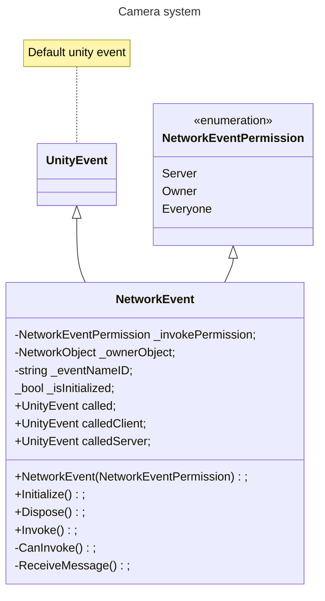
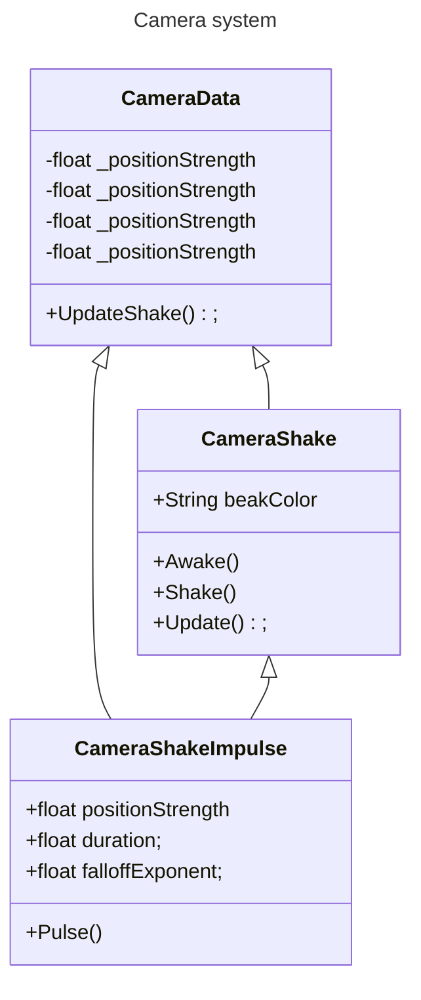

### Paraphrenia

Paraphrenia is a 2 player online co-op Horror Puzzle game with asymmetrical gameplay.

### Gameplay

Paraphrenia is played online, with two players. Both players play a different role in the game. The first player plays a Mental Health Patient, called Edith Hall. The patient is restrained in a wheelchair. The Patient has the ability to look trough the ghost's eyes and can see paranormal activity, which they must communicate to the second player in order to solve puzzles. The second player plays a Nurse. The nurse can move the wheelchair around and ask the patient questions through "in-game" chat, though they can also walk around alone. The player's need to communicate with eachother to solve the various puzzles found in the Psych ward.

### Horror Story

This game takes place in 1997 America, in an old Psych Ward. There is a ghost haunting the building that only the Patient can see, because of their personal connection to the ghost. The ghost tries to drive the patient insane, and will not shy away from violence and deceit to do so. During the game, the Patient needs to warn the Nurse to hide from the ghost's attacks. The ghost also moves objects, including the Patient's wheelchair.

### Team

The team behind Paraphrenia is called Ribbit Games. This team is a team of 7:

- Sarenka Calis:
Scrum Master, Environment Artist
- Sophie de Groot:
Technical Artist
- Eva van Kessel:
Concept Artist, 2D Artist
- Joost van der Knaap:
Lead Artist, Environment Artist
- Anna van der Wijden:
Character Artist
- Ingmar van Busschbach:
Lead Designer, Product owner, Developer, Sound Engineer
- Calvin Davidson:
Lead Developer, Networking Engineer


### Geproduceerde Game Onderdelen

#### Ingmar

Compositions and SFX:
[Soundtrack 1 Final Production](https://soundcloud.com/catequil/paraphrenia-soundtrack)
[Soundtrack 1 Score](https://musescore.com/user/3171721/scores/10967167)
[Soundtrack 2 Score](https://musescore.com/user/3171721/scores/10967170)
[Sound effects](https://github.com/Calvin-Davidson/Paraphrenia/tree/develop/Paraphrenia/Assets/Sound)

Scripts:
[High level event management](https://github.com/Calvin-Davidson/Paraphrenia/tree/develop/Paraphrenia/Assets/Scripts/Runtime/LevelEvents)
[High level gameplay functionality](https://github.com/Calvin-Davidson/Paraphrenia/tree/develop/Paraphrenia/Assets/Scripts/Runtime/GameplayScripts)
[Custom sound cue system](https://github.com/Calvin-Davidson/Paraphrenia/tree/develop/Paraphrenia/Assets/Scripts/Runtime/Sound)
[AI systems](https://github.com/Calvin-Davidson/Paraphrenia/tree/develop/Paraphrenia/Assets/Scripts/Runtime/AI)

```mermaid
---
title: Field of View
---
classDiagram
    ProceduralMesh <.. FieldOfView
    UVCalculator <.. FieldOfView
    ProceduralMesh <.. UVCalculator
    class FieldOfView{
        +struct ViewCastInfo
        +struct EdgeInfo
        +float viewRadius
        +float viewAngle
        +LayerMask targetMask
        +LayerMask obstacleMask

        -bool drawFieldOfView
        -bool clampUvToBounds
        -float tickDelay
        -float meshResolution
        -float uvResolution
        -float edgeDistanceThreshold
        -int edgeResolveIterations
        -MeshFilter viewMeshFilter
        -Mesh _viewMesh

        +DirectionFromAngle(float angleInDegrees, bool angleIsGlobal) Vector3
        -Start()
        -LateUpdate()
        -FindTargetsWithDelay(float delay) IEnumerator
        -FindVisibleTargets()
        -DrawFieldOfView()
        -FindEdge(ViewCastInfo minViewCast, ViewCastInfo maxViewCast) EdgeInfo
        -ViewCast(float globalAngle) ViewCastInfo
    }
    class UVCalculator{
        <<enumeration>>
        Up
        Forward
        Right

        +CalculateUVs(Vector3[] vertices, float scale, bool clipToBounds = false) Vector2[]
        -CalculateDirection(Vector3 v) FacingDirection
        -DotCalculator(Vector3 v, Vector3 dir, FacingDirection p, ref float maxDot, ref FacingDirection normalDirection) bool
        -ScaleUV(float uv1, float uv2, float scale, bool clipToBounds = false, float boundsX = 1, float boundsY = 1) Vector2
        -RecalculateBounds(Vector3 vertex, ref Vector3 startLocation, ref Vector3 endLocation)
    }
    class ProceduralMesh {

    }
}
```

[Editor script for field of view script](https://github.com/Calvin-Davidson/Paraphrenia/tree/develop/Paraphrenia/Assets/Scripts/Editor)
[HLSL post processing shader](https://github.com/Calvin-Davidson/Paraphrenia/tree/develop/Paraphrenia/Assets/Shaders/PostProcessing_Shaders)

#### Calvin

[NetworkEvent](https://github.com/Calvin-Davidson/Paraphrenia/tree/develop/Paraphrenia/Assets/Scripts/Runtime/Networking/NetworkEvent)

[All/Most Networking logic](https://github.com/Calvin-Davidson/Paraphrenia/tree/develop/Paraphrenia/Assets/Scripts/Runtime/Networking)

[Level designs](https://github.com/Calvin-Davidson/Paraphrenia/wiki/Functional-Design#level-design)

[Player movement / Camera logic](https://github.com/Calvin-Davidson/Paraphrenia/tree/develop/Paraphrenia/Assets/Scripts/Runtime/Player)

[CameraShake](https://github.com/Calvin-Davidson/Paraphrenia/tree/develop/Paraphrenia/Assets/Scripts/Runtime/CameraSystems)

