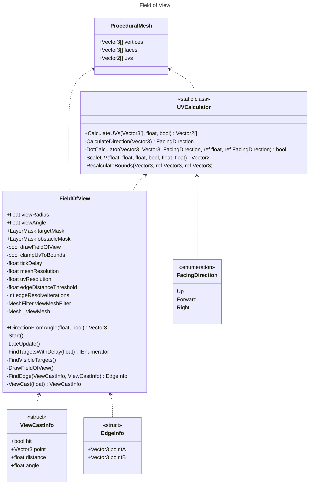
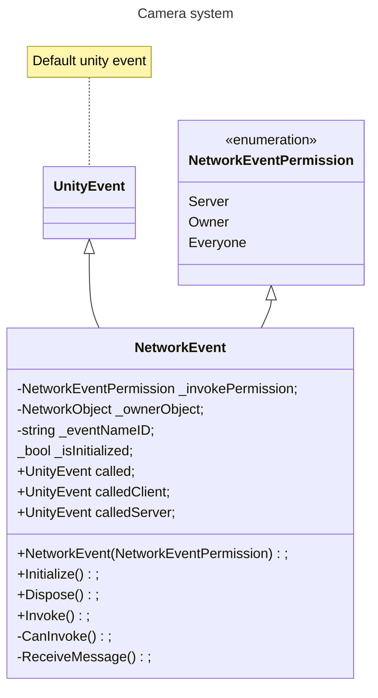
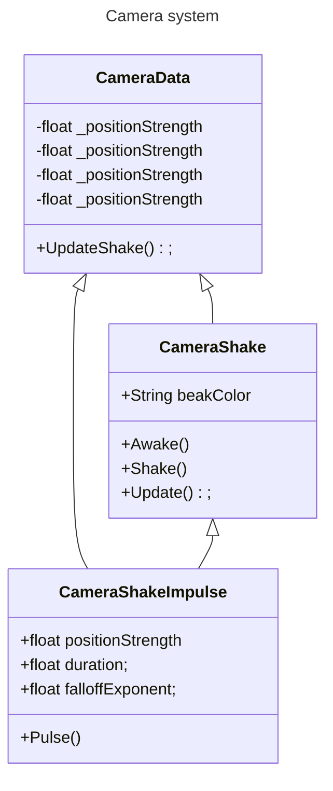

### Paraphrenia

Paraphrenia is a 2 player online co-op Horror Puzzle game with asymmetrical gameplay.

### Gameplay

Paraphrenia is played online, with two players. Both players play a different role in the game. The first player plays a Mental Health Patient, called Edith Hall. The patient is restrained in a wheelchair. The Patient has the ability to look trough the ghost's eyes and can see paranormal activity, which they must communicate to the second player in order to solve puzzles. The second player plays a Nurse. The nurse can move the wheelchair around and ask the patient questions through "in-game" chat, though they can also walk around alone. The player's need to communicate with eachother to solve the various puzzles found in the Psych ward.

### Horror Story

This game takes place in 1997 America, in an old Psych Ward. There is a ghost haunting the building that only the Patient can see, because of their personal connection to the ghost. The ghost tries to drive the patient insane, and will not shy away from violence and deceit to do so. During the game, the Patient needs to warn the Nurse to hide from the ghost's attacks. The ghost also moves objects, including the Patient's wheelchair.

### Team

The team behind Paraphrenia is called Ribbit Games. This team is a team of 7:

- Sarenka Calis:
Scrum Master, Environment Artist
- Sophie de Groot:
Technical Artist
- Eva van Kessel:
Concept Artist, 2D Artist
- Joost van der Knaap:
Lead Artist, Environment Artist
- Anna van der Wijden:
Character Artist
- Ingmar van Busschbach:
Lead Designer, Product owner, Developer, Sound Engineer
- Calvin Davidson:
Lead Developer, Networking Engineer

### Geproduceerde Game Onderdelen

#### Ingmar

Compositions and SFX:

[Main Soundtrack](https://soundcloud.com/catequil/paraphrenia-soundtrack) made for the game. Initial [Piano Score](https://musescore.com/user/3171721/scores/10967167) was composed in Musescore 4, then produced in Cakewalk. This song plays during the main menu, as well as in-game during certain moments.

[High Action Soundtrack](https://musescore.com/user/3171721/scores/10967170) made for chase moments in the game. It was composed in Musescore 4, and is implemented in-game as-is.

[Sound effects](https://github.com/Calvin-Davidson/Paraphrenia/tree/develop/Paraphrenia/Assets/Sound) made specifically for the game, by recording source audio in MA's radio studio, as well as sound effects sourced from the internet. All sounds are mixed and tuned by me.

Scripts:

[High level event management](https://github.com/Calvin-Davidson/Paraphrenia/tree/develop/Paraphrenia/Assets/Scripts/Runtime/LevelEvents)

[High level gameplay functionality](https://github.com/Calvin-Davidson/Paraphrenia/tree/develop/Paraphrenia/Assets/Scripts/Runtime/GameplayScripts)

[Custom sound cue system](https://github.com/Calvin-Davidson/Paraphrenia/tree/develop/Paraphrenia/Assets/Scripts/Runtime/Sound)

[AI systems](https://github.com/Calvin-Davidson/Paraphrenia/tree/develop/Paraphrenia/Assets/Scripts/Runtime/AI)

[Editor script for field of view script](https://github.com/Calvin-Davidson/Paraphrenia/tree/develop/Paraphrenia/Assets/Scripts/Editor)

Shader work:

I made a custom [HLSL post processing shader](https://github.com/Calvin-Davidson/Paraphrenia/tree/develop/Paraphrenia/Assets/Shaders/PostProcessing_Shaders) to give a strong visual distinction between the Enemy's view and a player's view. You can compare it here:

Level Design:

All lighting work was done by me. Most of our project has been showcased using my initial lighting pass. This pass is mostly done in post processing, with Exposure, Color Correction, Fog, Ambient Occlusion, Bloom, Lift Gamma & Gain, Shadows Midtones & Highlights, Vignette, Panini Projection, Chromatic Abberation, Lens Distortion and Film Grain. Reflections were handled purely through Specular Highlights in our PBR shaders. This created high visual fidelity, but performance suffered, with average framerate on our test devices being around 20 FPS:

The final lighting pass was much more optimized. The first step was taking out the less important post processing effects and imitating their effects with the remaining post processing effects, with reflections being handled by accumulative Screen Space Reflections:

[]https://youtu.be/vlJJwHPW3DQ)

After that, light sources were optimized, by limiting the influence radius of all light sources. Indirect lighting was baked. Shadow resolutions were optimized. Reflections were optimized. All in all this brought the performance back to a very respectable 90 FPS.

#### Calvin

[NetworkEvent](https://github.com/Calvin-Davidson/Paraphrenia/tree/develop/Paraphrenia/Assets/Scripts/Runtime/Networking/NetworkEvent)

[All/Most Networking logic](https://github.com/Calvin-Davidson/Paraphrenia/tree/develop/Paraphrenia/Assets/Scripts/Runtime/Networking)

[Level designs](https://github.com/Calvin-Davidson/Paraphrenia/wiki/Functional-Design#level-design)

[Player movement / Camera logic](https://github.com/Calvin-Davidson/Paraphrenia/tree/develop/Paraphrenia/Assets/Scripts/Runtime/Player)

[CameraShake](https://github.com/Calvin-Davidson/Paraphrenia/tree/develop/Paraphrenia/Assets/Scripts/Runtime/CameraSystems)

